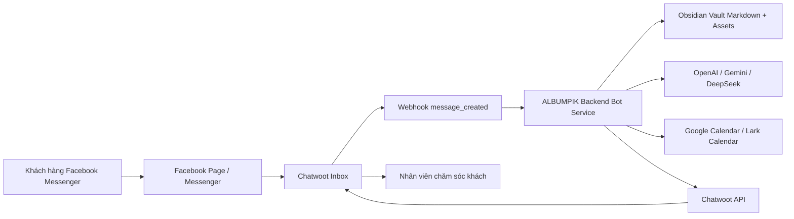
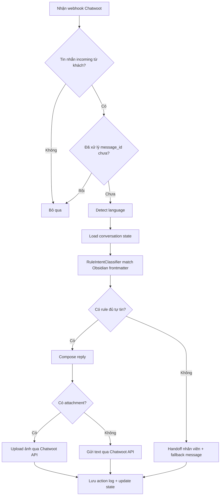

# ALBUMPIK Auto Reply Bot - Phase 1 và Phase 2

Ngày tổng hợp: 2026-04-25

## 1. Kết luận nhanh

Ý tưởng tích hợp bot riêng cho ALBUMPIK là khả thi.

Kiến trúc nên đi theo hướng:

- Chatwoot tiếp tục làm inbox trung tâm, nhận tin từ Facebook Messenger và hiển thị hội thoại cho nhân viên.
- ALBUMPIK backend làm "bộ não" của bot, vì backend đã có ngữ cảnh nghiệp vụ, tài khoản studio, dữ liệu album, lịch hẹn và có thể gọi nội bộ qua Docker network.
- Obsidian Vault làm nguồn tri thức dễ sửa cho nhân viên: câu tư vấn, bảng giá, ảnh bảng giá, quy tắc đặt lịch, FAQ.
- LLM như OpenAI, Gemini hoặc DeepSeek chỉ dùng để hiểu ngôn ngữ khách hỏi, trích xuất ý định, viết lại câu trả lời tự nhiên đa ngôn ngữ. Không để LLM tự bịa giá, tự quyết định lịch, hoặc tự tạo thông tin không có trong knowledge.
- Phase 1 nên làm theo hướng rule-first, đơn giản, ổn định, dễ kiểm soát.
- Phase 2 mới mở rộng sang RAG/vector search, knowledge graph, kiểm tra lịch trống và tự tạo/cập nhật sự kiện Google Calendar hoặc Lark Calendar.

Nguyên tắc quan trọng nhất:

> Rule và dữ liệu trong Obsidian là nguồn sự thật. LLM chỉ là lớp diễn đạt và hỗ trợ hiểu ngôn ngữ.

## 2. Kiến trúc tổng quan



Luồng xử lý chính:

1. Khách nhắn vào Facebook Messenger.
2. Chatwoot nhận tin nhắn và tạo event `message_created`.
3. Chatwoot gọi webhook nội bộ đến ALBUMPIK backend.
4. Backend kiểm tra tin nhắn có phải incoming từ khách không.
5. Backend chống xử lý trùng bằng `message_id` hoặc `conversation_id + message_id`.
6. Backend đọc trạng thái hội thoại hiện tại.
7. Backend phân loại ý định bằng rule trước, LLM hỗ trợ nếu cần.
8. Backend tìm tài liệu phù hợp trong Obsidian Vault.
9. Backend tạo câu trả lời theo ngôn ngữ của khách.
10. Nếu cần gửi bảng giá, backend upload ảnh từ Vault assets lên Chatwoot như attachment.
11. Nếu bot tự tin, backend gửi tin nhắn qua Chatwoot API.
12. Nếu không tự tin hoặc khách cần xử lý phức tạp, backend gắn nhãn/chuyển nhân viên.

## 3. Phase 1 - Rule + Obsidian Frontmatter

### 3.1. Mục tiêu Phase 1

Phase 1 tập trung vào bot trả lời tự động an toàn cho các tình huống phổ biến:

- Hỏi giá thuê đồ.
- Hỏi giá chụp ảnh.
- Gửi ảnh bảng giá tương ứng.
- Trả lời FAQ đơn giản.
- Nhận biết ngôn ngữ khách đang dùng và trả lời cùng ngôn ngữ đó.
- Hỏi thêm thông tin đặt lịch cơ bản như ngày, giờ, số người, loại dịch vụ.
- Chuyển nhân viên khi không chắc chắn hoặc có tình huống nhạy cảm.

Phase 1 không nên cố làm quá nhiều:

- Chưa cần knowledge graph thật.
- Chưa cần vector database nếu rule/keyword đủ dùng.
- Chưa cần tự động tạo lịch thật ngay từ đầu.
- Chưa cần tự quyết định khuyến mãi, giảm giá, hoàn tiền, đổi lịch phức tạp.
- Chưa cần cho bot xử lý khiếu nại.

### 3.2. Phạm vi backend cần làm trong Phase 1

Backend cần có các module chính:

- `ChatwootWebhookController`: nhận webhook từ Chatwoot.
- `ChatwootWebhookVerifier`: xác thực webhook nếu có secret.
- `ChatwootMessageParser`: chuẩn hóa payload Chatwoot thành object nội bộ.
- `MessageDeduplicationService`: chống xử lý lại cùng một tin nhắn.
- `ConversationStateService`: lưu trạng thái hội thoại.
- `ObsidianKnowledgeRepository`: đọc Markdown và frontmatter từ Vault.
- `RuleIntentClassifier`: match intent bằng keyword, aliases, priority và conditions.
- `LlmLanguageService`: phát hiện ngôn ngữ và viết lại câu trả lời tự nhiên nếu cần.
- `ReplyComposer`: ghép câu trả lời cuối cùng từ rule, nội dung Markdown và LLM.
- `AttachmentResolver`: kiểm tra file ảnh trong Vault assets và chuẩn bị upload.
- `ChatwootReplyClient`: gửi tin nhắn/attachment vào Chatwoot.
- `HumanHandoffService`: gắn label, note hoặc chuyển trạng thái để nhân viên xử lý.

### 3.3. Tiêu chí thành công Phase 1

Phase 1 được xem là đạt khi:

- Tin nhắn hỏi "giá thuê kimono", "bảng giá thuê đồ", "rental price", "レンタル料金" đều trả lời đúng rule thuê đồ.
- Tin nhắn hỏi "giá chụp ảnh", "chụp couple bao nhiêu", "photo shooting price" đều trả lời đúng rule chụp ảnh.
- Bot gửi được ảnh bảng giá qua Chatwoot, không chỉ gửi text.
- Bot không trả lời tin nhắn outgoing do chính bot hoặc nhân viên gửi.
- Bot không xử lý trùng khi Chatwoot retry webhook.
- Bot biết chuyển nhân viên khi không tìm được rule phù hợp.
- Nhân viên có thể sửa nội dung tư vấn bằng cách sửa file Markdown trong Obsidian Vault.
- Không cần deploy lại backend khi chỉ thay đổi nội dung tư vấn hoặc ảnh bảng giá, nếu backend có cơ chế reload/index lại Vault.

### 3.4. Luồng xử lý Phase 1



## 4. Phase 2 - RAG, Calendar và tự động đặt lịch

### 4.1. Mục tiêu Phase 2

Phase 2 mở rộng từ bot tư vấn sang bot hỗ trợ đặt lịch:

- Hiểu hội thoại nhiều lượt tốt hơn.
- Tìm tri thức bằng vector search/RAG thay vì chỉ keyword.
- Trích xuất thông tin đặt lịch: dịch vụ, ngày, giờ, số người, tên khách, ngôn ngữ, yêu cầu đặc biệt.
- Kiểm tra lịch trống.
- Đề xuất slot còn trống.
- Tạo sự kiện Google Calendar hoặc Lark Calendar sau khi khách xác nhận.
- Cập nhật hoặc hủy lịch nếu khách muốn đổi thời gian.
- Gắn nhãn hội thoại trong Chatwoot theo trạng thái: `bot_qualified`, `booking_pending`, `booking_confirmed`, `handoff_required`.

### 4.2. Phạm vi backend cần làm trong Phase 2

Backend nên bổ sung:

- `EmbeddingIndexer`: index nội dung Obsidian sang vector store.
- `VectorKnowledgeRetriever`: tìm tài liệu liên quan theo semantic search.
- `BookingStateMachine`: quản lý luồng đặt lịch nhiều bước.
- `AvailabilityService`: kiểm tra slot trống.
- `CalendarProvider`: interface chung cho Google/Lark.
- `GoogleCalendarProvider`: tạo/sửa/hủy event Google Calendar.
- `LarkCalendarProvider`: tạo/sửa/hủy event Lark Calendar.
- `BookingConfirmationService`: xác nhận lại thông tin trước khi ghi lịch.
- `BotConfidencePolicy`: quyết định khi nào bot được tự trả lời, khi nào cần nhân viên.
- `BotAnalyticsService`: thống kê intent, tỷ lệ handoff, số booking thành công.

### 4.3. Tiêu chí thành công Phase 2

Phase 2 được xem là đạt khi:

- Khách hỏi lịch bằng tiếng Việt, Nhật hoặc Anh, bot vẫn hiểu đúng ngày giờ.
- Bot hỏi lại khi thiếu thông tin quan trọng.
- Bot không tạo lịch nếu khách chưa xác nhận rõ ràng.
- Bot tạo được event trên Google Calendar hoặc Lark Calendar.
- Bot lưu được `calendar_event_id` để sau này sửa/hủy.
- Nhân viên có thể thấy trạng thái booking trong Chatwoot hoặc ALBUMPIK admin.
- Có log đầy đủ để kiểm tra vì sao bot trả lời như vậy.

## 5. Cấu trúc Obsidian Vault đề xuất

Đặt Vault trong backend, ví dụ:

```text
backend/
  knowledge/
    obsidian-vault/
      00-system/
        bot-policy.md
        fallback.md
        handoff-rules.md
      services/
        rental-price.md
        photo-price.md
        kimono-rental.md
        wedding-photo.md
      booking/
        booking-flow.md
        change-booking-time.md
        cancel-booking.md
      faq/
        delivery.md
        makeup.md
        photo-retouch.md
        payment.md
      assets/
        prices/
          bang-gia-thue-do-vi.jpg
          bang-gia-chup-anh-vi.jpg
          rental-price-ja.jpg
          photo-price-ja.jpg
```

Quy ước:

- Mỗi file Markdown đại diện cho một rule hoặc một nhóm tri thức nhỏ.
- Mỗi file phải có frontmatter YAML ở đầu file.
- Ảnh bảng giá đặt trong `assets/`, đường dẫn attachment trong frontmatter là đường dẫn tương đối từ root Vault.
- Không để thông tin quan trọng chỉ nằm trong ảnh. Body Markdown nên có mô tả ngắn để bot hiểu ảnh đó dùng cho trường hợp nào.
- Không nhét quá nhiều intent vào một file. Một file nên xử lý một ý định chính.

## 6. Chuẩn frontmatter cho Rule + Obsidian

### 6.1. Template chuẩn

```markdown
---
id: price-rental-kimono-2026
type: rule
status: active
priority: 100
version: 1
owner: haiyen-studio

language: vi
supported_languages:
  - vi
  - ja
  - en

intent: price_rental
intent_aliases:
  - rental_price
  - kimono_price
  - costume_rental_price

keywords:
  - giá thuê
  - bảng giá thuê
  - thuê đồ
  - thuê kimono
  - thuê yukata

negative_keywords:
  - giá chụp
  - chụp ảnh
  - makeup

channels:
  - facebook
  - chatwoot

conditions:
  service: rental
  location: tokyo
  customer_type: all

response:
  mode: text_and_attachments
  tone: friendly
  answer_strategy: use_markdown_body_then_rewrite
  require_human_review: false
  max_reply_sentences: 4

attachments:
  - id: rental-price-vi
    type: image
    path: assets/prices/bang-gia-thue-do-vi.jpg
    content_type: image/jpeg
    caption: Bảng giá thuê đồ

cta:
  ask_next: Anh/chị muốn thuê đồ cho mấy người và muốn chụp/ngày thuê vào ngày nào ạ?

handoff:
  required_when:
    - customer_complaint
    - discount_request
    - unclear_custom_package

calendar:
  required: false

updated_at: 2026-04-25
---

Khi khách hỏi về giá thuê đồ, hãy gửi ảnh bảng giá thuê đồ và giải thích ngắn gọn rằng giá có thể thay đổi theo loại trang phục, số người và thời điểm.

Nếu khách muốn đặt lịch, hãy hỏi thêm ngày, giờ, số người và loại trang phục mong muốn.
```

### 6.2. Ý nghĩa các field

| Field | Bắt buộc | Ý nghĩa |
| --- | --- | --- |
| `id` | Có | ID ổn định, không đổi khi đổi tên file. Backend dùng để log và debug. |
| `type` | Có | Loại tài liệu. Phase 1 dùng `rule`, Phase 2 có thể thêm `faq`, `policy`, `booking_flow`. |
| `status` | Có | `active`, `draft`, `archived`. Backend chỉ dùng `active`. |
| `priority` | Có | Số càng cao càng ưu tiên khi nhiều rule cùng match. |
| `version` | Có | Version nội dung để debug khi rule thay đổi. |
| `owner` | Không | Studio hoặc team sở hữu nội dung. |
| `language` | Có | Ngôn ngữ chính của file. |
| `supported_languages` | Có | Các ngôn ngữ bot được phép trả lời từ rule này. |
| `intent` | Có | Ý định chính, ví dụ `price_rental`, `price_photo`, `booking_request`. |
| `intent_aliases` | Không | Tên intent phụ để classifier dễ match. |
| `keywords` | Có | Từ khóa tích cực. Dùng để match rule. |
| `negative_keywords` | Không | Nếu message chứa từ này thì trừ điểm hoặc loại rule. |
| `channels` | Không | Kênh áp dụng, ví dụ `facebook`, `instagram`, `chatwoot`. |
| `conditions` | Không | Điều kiện nghiệp vụ như service/location/customer_type. |
| `response.mode` | Có | `text_only`, `attachments_only`, `text_and_attachments`, `handoff`. |
| `response.tone` | Không | Giọng điệu: `friendly`, `polite`, `short`, `premium`. |
| `response.answer_strategy` | Không | Cách tạo câu trả lời. Phase 1 nên dùng `use_markdown_body_then_rewrite`. |
| `response.require_human_review` | Không | Nếu `true`, bot không gửi trực tiếp mà chuyển nhân viên. |
| `attachments` | Không | Danh sách ảnh/file cần gửi. |
| `cta.ask_next` | Không | Câu hỏi tiếp theo để kéo khách vào luồng đặt lịch. |
| `handoff.required_when` | Không | Các tình huống bắt buộc chuyển người thật. |
| `calendar.required` | Không | Phase 1 thường `false`, Phase 2 dùng cho booking. |
| `updated_at` | Có | Ngày cập nhật nội dung. |

## 7. Ví dụ rule cho bảng giá thuê đồ

```markdown
---
id: price-rental-general-2026
type: rule
status: active
priority: 100
version: 1
language: vi
supported_languages:
  - vi
  - ja
  - en
intent: price_rental
intent_aliases:
  - rental_price
  - costume_price
keywords:
  - giá thuê
  - thuê đồ
  - thuê kimono
  - thuê yukata
  - bảng giá thuê
negative_keywords:
  - giá chụp
  - album ảnh
response:
  mode: text_and_attachments
  tone: friendly
  answer_strategy: use_markdown_body_then_rewrite
  require_human_review: false
attachments:
  - id: rental-price-vi
    type: image
    path: assets/prices/bang-gia-thue-do-vi.jpg
    content_type: image/jpeg
    caption: Bảng giá thuê đồ
cta:
  ask_next: Anh/chị muốn thuê cho mấy người và dự định đi ngày nào ạ?
calendar:
  required: false
updated_at: 2026-04-25
---

Khách đang hỏi về giá thuê trang phục.

Hãy gửi ảnh bảng giá thuê đồ. Trả lời ngắn gọn, lịch sự, không tự nhập lại toàn bộ giá nếu giá đã nằm trong ảnh.

Nếu khách hỏi thêm về đặt lịch, hãy hỏi ngày, giờ, số người và loại trang phục mong muốn.
```

## 8. Ví dụ rule cho bảng giá chụp ảnh

```markdown
---
id: price-photo-general-2026
type: rule
status: active
priority: 95
version: 1
language: vi
supported_languages:
  - vi
  - ja
  - en
intent: price_photo
intent_aliases:
  - photo_price
  - shooting_price
  - package_price
keywords:
  - giá chụp
  - bảng giá chụp
  - chụp ảnh bao nhiêu
  - combo chụp
  - gói chụp
negative_keywords:
  - chỉ thuê đồ
  - thuê kimono
response:
  mode: text_and_attachments
  tone: friendly
  answer_strategy: use_markdown_body_then_rewrite
  require_human_review: false
attachments:
  - id: photo-price-vi
    type: image
    path: assets/prices/bang-gia-chup-anh-vi.jpg
    content_type: image/jpeg
    caption: Bảng giá chụp ảnh
cta:
  ask_next: Anh/chị muốn chụp mấy người và dự định chụp ngày nào ạ?
calendar:
  required: false
updated_at: 2026-04-25
---

Khách đang hỏi về bảng giá chụp ảnh.

Hãy gửi ảnh bảng giá chụp ảnh và giải thích ngắn gọn rằng team có thể tư vấn gói phù hợp theo số người, địa điểm và thời gian chụp.
```

## 9. Ví dụ rule cho yêu cầu đổi lịch

```markdown
---
id: booking-change-time-2026
type: rule
status: active
priority: 90
version: 1
language: vi
supported_languages:
  - vi
  - ja
  - en
intent: booking_change_time
intent_aliases:
  - reschedule
  - change_booking
keywords:
  - đổi lịch
  - dời lịch
  - đổi giờ
  - đổi ngày
  - reschedule
  - 日程変更
response:
  mode: text_only
  tone: polite
  answer_strategy: ask_for_missing_slots
  require_human_review: true
required_slots:
  - current_booking_time
  - requested_booking_time
  - customer_name
handoff:
  required_when:
    - always
calendar:
  required: true
  action: update_event
updated_at: 2026-04-25
---

Khách muốn đổi lịch.

Phase 1: thu thập ngày giờ hiện tại, ngày giờ muốn đổi và tên khách, sau đó chuyển nhân viên xác nhận.

Phase 2: sau khi khách cung cấp đủ thông tin, kiểm tra lịch trống và đề xuất slot mới. Chỉ cập nhật Calendar sau khi khách xác nhận rõ ràng.
```

## 10. Quy tắc match rule trong backend

Phase 1 nên dùng thuật toán đơn giản, dễ debug:

1. Load tất cả Markdown có `status: active`.
2. Bỏ qua rule không thuộc channel hiện tại nếu `channels` có khai báo.
3. Tính điểm keyword:
   - Mỗi keyword match cộng điểm.
   - Keyword dài và cụ thể nên có điểm cao hơn keyword ngắn.
   - Nếu match `intent_aliases` từ LLM/classifier thì cộng điểm.
4. Nếu message chứa `negative_keywords`, trừ điểm hoặc loại rule.
5. Nếu nhiều rule cùng match, chọn rule có điểm cao nhất.
6. Nếu điểm bằng nhau, chọn rule có `priority` cao hơn.
7. Nếu điểm dưới threshold, không tự trả lời. Gửi fallback hoặc handoff.
8. Log lại `rule_id`, `score`, `matched_keywords`, `language`, `conversation_id`.

Không nên để LLM chọn rule một cách mù mờ trong Phase 1. LLM có thể hỗ trợ tạo `detected_intent`, nhưng rule engine vẫn phải là lớp quyết định cuối cùng.

## 11. Prompt chi tiết cho AI/coder phía backend

Có thể copy prompt dưới đây và đưa cho AI coding agent ở repo backend của ALBUMPIK.

````markdown
# Nhiệm vụ: Xây Phase 1 Auto Reply Bot cho ALBUMPIK bằng Rule + Obsidian Frontmatter

Bạn là AI coding agent phụ trách backend ALBUMPIK.

## Bối cảnh hệ thống

ALBUMPIK hiện có 3 phần chính:

- Chatwoot self-host dùng làm inbox chăm sóc khách hàng.
- ALBUMPIK backend chứa nghiệp vụ chính.
- ALBUMPIK frontend là giao diện người dùng/studio.

Cả 3 service chạy trong cùng một Docker network nên backend có thể gọi Chatwoot bằng internal URL. Chatwoot đang nhận tin nhắn từ Facebook Messenger. Mục tiêu là để backend nhận webhook từ Chatwoot, đọc knowledge trong Obsidian Vault và tự động trả lời khách hàng trong Chatwoot.

Không dùng Chatwoot Captain trong Phase 1.

## Mục tiêu Phase 1

Xây bot tự động trả lời các câu hỏi phổ biến:

- Hỏi giá thuê đồ.
- Hỏi giá chụp ảnh.
- Gửi ảnh bảng giá thuê đồ.
- Gửi ảnh bảng giá chụp ảnh.
- Hỏi thêm thông tin đặt lịch cơ bản.
- Chuyển nhân viên khi bot không chắc chắn.

Bot cần trả lời bằng cùng ngôn ngữ mà khách đang hỏi nếu có thể. Ví dụ khách hỏi tiếng Việt thì trả lời tiếng Việt, khách hỏi tiếng Nhật thì trả lời tiếng Nhật, khách hỏi tiếng Anh thì trả lời tiếng Anh.

## Nguyên tắc bắt buộc

1. Obsidian Vault là nguồn sự thật.
2. Không để LLM tự bịa giá, tự tạo chính sách, tự quyết định khuyến mãi.
3. Không cho LLM đọc toàn bộ Vault mỗi request. Backend phải parse/index Vault trước, sau đó chỉ đưa rule/tài liệu liên quan cho LLM.
4. Không trả lời tin nhắn do nhân viên hoặc bot gửi ra.
5. Phải chống xử lý trùng webhook.
6. Nếu không đủ tự tin, phải handoff cho nhân viên.
7. Nếu rule có `response.require_human_review: true`, không gửi câu trả lời tự động cuối cùng.
8. Nếu có attachment, phải gửi file qua Chatwoot API, không gửi local path cho khách.
9. Access token, API key và secret phải để trong biến môi trường.
10. Log đủ thông tin để debug rule nào đã được dùng.

## Cấu trúc thư mục cần tạo

Tạo hoặc hỗ trợ cấu trúc tương tự:

```text
knowledge/
  obsidian-vault/
    00-system/
      bot-policy.md
      fallback.md
      handoff-rules.md
    services/
      rental-price.md
      photo-price.md
    booking/
      booking-flow.md
      change-booking-time.md
    faq/
      payment.md
      makeup.md
    assets/
      prices/
        bang-gia-thue-do-vi.jpg
        bang-gia-chup-anh-vi.jpg
```

## Frontmatter Markdown bắt buộc hỗ trợ

Backend cần parse YAML frontmatter ở đầu file Markdown.

Ví dụ:

```markdown
---
id: price-rental-general-2026
type: rule
status: active
priority: 100
version: 1
language: vi
supported_languages:
  - vi
  - ja
  - en
intent: price_rental
intent_aliases:
  - rental_price
  - costume_price
keywords:
  - giá thuê
  - bảng giá thuê
  - thuê đồ
  - thuê kimono
negative_keywords:
  - giá chụp
  - album ảnh
response:
  mode: text_and_attachments
  tone: friendly
  answer_strategy: use_markdown_body_then_rewrite
  require_human_review: false
attachments:
  - id: rental-price-vi
    type: image
    path: assets/prices/bang-gia-thue-do-vi.jpg
    content_type: image/jpeg
    caption: Bảng giá thuê đồ
cta:
  ask_next: Anh/chị muốn thuê cho mấy người và dự định đi ngày nào ạ?
calendar:
  required: false
updated_at: 2026-04-25
---

Khách đang hỏi về giá thuê trang phục.

Hãy gửi ảnh bảng giá thuê đồ. Trả lời ngắn gọn, lịch sự, không tự nhập lại toàn bộ giá nếu giá đã nằm trong ảnh.
```

## Module backend cần triển khai

Triển khai các module/service sau, đặt tên theo convention của repo backend hiện tại:

1. `ChatwootWebhookController`
   - Nhận request webhook từ Chatwoot.
   - Chỉ xử lý event `message_created`.
   - Trả HTTP 200 nhanh nếu event không liên quan.

2. `ChatwootMessageParser`
   - Chuẩn hóa payload Chatwoot.
   - Output tối thiểu gồm:
     - `account_id`
     - `conversation_id`
     - `message_id`
     - `message_type`
     - `content`
     - `sender_type`
     - `inbox_id`
     - `channel`
     - `created_at`

3. `MessageDeduplicationService`
   - Lưu message đã xử lý.
   - Nếu cùng `message_id` đã xử lý thì bỏ qua.
   - Cần an toàn khi Chatwoot retry webhook.

4. `ConversationStateService`
   - Lưu trạng thái theo `conversation_id`.
   - Phase 1 tối thiểu lưu:
     - `detected_language`
     - `last_intent`
     - `last_rule_id`
     - `booking_slots` nếu có
     - `handoff_required`

5. `ObsidianKnowledgeRepository`
   - Đọc tất cả file `.md` trong Vault.
   - Parse YAML frontmatter và Markdown body.
   - Chỉ load document `status: active`.
   - Resolve attachment path tương đối từ root Vault.
   - Có thể cache kết quả trong memory.
   - Có cơ chế reload bằng endpoint nội bộ hoặc tự reload theo file modified time.

6. `RuleIntentClassifier`
   - Input: normalized message, detected language, active knowledge docs.
   - Match bằng `keywords`, `intent_aliases`, `negative_keywords`, `priority`.
   - Output:
     - `matched: true/false`
     - `rule_id`
     - `intent`
     - `score`
     - `matched_keywords`
     - `reason`

7. `LlmLanguageService`
   - Dùng OpenAI/Gemini/DeepSeek nếu được cấu hình.
   - Phase 1 chỉ dùng cho:
     - Detect language khi rule không chắc.
     - Viết lại câu trả lời tự nhiên dựa trên Markdown body.
   - Không được hỏi LLM về giá nếu rule không có dữ liệu.
   - Nếu LLM lỗi, fallback sang câu trả lời template từ Markdown.

8. `ReplyComposer`
   - Tạo final reply.
   - Input gồm: customer message, matched rule, markdown body, cta, detected language.
   - Nếu `response.mode` là `text_and_attachments`, output gồm text + attachments.
   - Nếu `response.require_human_review` là `true`, không gửi trực tiếp, chỉ tạo internal note/handoff.

9. `AttachmentResolver`
   - Kiểm tra file attachment có tồn tại.
   - Validate content type.
   - Không cho path traversal.
   - Chỉ cho phép file nằm trong Vault.

10. `ChatwootReplyClient`
    - Gửi outgoing message vào Chatwoot qua API.
    - Hỗ trợ gửi text.
    - Hỗ trợ gửi attachment/image.
    - Header dùng Chatwoot user access token: `api_access_token`.

11. `HumanHandoffService`
    - Khi bot không chắc hoặc rule yêu cầu review:
      - Gắn label nếu backend hỗ trợ Chatwoot label API.
      - Hoặc gửi private note cho nhân viên.
      - Không spam khách.

12. `BotActionLogService`
    - Log mỗi quyết định:
      - `conversation_id`
      - `message_id`
      - `detected_language`
      - `intent`
      - `rule_id`
      - `score`
      - `action`
      - `attachments`
      - `error`

## Biến môi trường đề xuất

```env
CHATWOOT_BASE_URL=http://chatwoot:3000
CHATWOOT_ACCOUNT_ID=6
CHATWOOT_API_ACCESS_TOKEN=replace_me
CHATWOOT_WEBHOOK_SECRET=replace_me

BOT_OBSIDIAN_VAULT_PATH=/app/knowledge/obsidian-vault
BOT_AUTO_REPLY_ENABLED=true
BOT_MIN_RULE_SCORE=30
BOT_DEFAULT_LANGUAGE=vi
BOT_LLM_PROVIDER=openai
BOT_LLM_API_KEY=replace_me
BOT_LLM_MODEL=gpt-4.1-mini
```

Tên biến có thể điều chỉnh theo convention của repo backend, nhưng ý nghĩa phải giữ nguyên.

## Luồng xử lý chi tiết

Khi nhận webhook:

1. Parse payload.
2. Nếu event không phải `message_created`, return 200.
3. Nếu message không phải incoming từ khách, return 200.
4. Nếu content rỗng và không có attachment cần xử lý, return 200.
5. Check deduplication theo `message_id`.
6. Detect language sơ bộ bằng rule hoặc LLM.
7. Load active docs từ ObsidianKnowledgeRepository.
8. RuleIntentClassifier chọn rule phù hợp.
9. Nếu không match:
   - Gửi fallback ngắn nếu policy cho phép.
   - Handoff nhân viên.
   - Log action `handoff_no_rule`.
10. Nếu match rule nhưng `require_human_review: true`:
   - Tạo private note hoặc label cho nhân viên.
   - Không gửi auto reply cuối cùng cho khách, trừ khi rule có fallback an toàn.
11. Nếu match rule và được phép trả lời:
   - Compose reply text.
   - Resolve attachments.
   - Gửi text/attachments vào Chatwoot.
   - Update conversation state.
   - Log action `auto_replied`.

## Cách compose reply

Reply phải tuân thủ:

- Ngắn gọn.
- Lịch sự.
- Cùng ngôn ngữ với khách nếu có thể.
- Không nói "tôi là AI" trừ khi policy yêu cầu.
- Không bịa giá nếu bảng giá nằm trong ảnh.
- Nếu gửi ảnh bảng giá, text chỉ cần giới thiệu ảnh và hỏi bước tiếp theo.

Ví dụ với khách hỏi: "Mình thuê kimono cho 3 người giá sao ạ?"

Output mong muốn:

"Dạ em gửi anh/chị bảng giá thuê đồ ở ảnh bên dưới ạ. Giá sẽ tùy loại trang phục và số người. Anh/chị dự định thuê cho ngày nào để bên em kiểm tra lịch hỗ trợ mình nhé?"

Kèm attachment: `assets/prices/bang-gia-thue-do-vi.jpg`

## Checklist nghiệm thu Phase 1

Tạo dữ liệu mẫu trong Vault và test các case:

1. "giá thuê kimono bao nhiêu" -> gửi rule `price_rental` + ảnh bảng giá thuê.
2. "combo chụp thì đã bao gồm tiền thuê và make chưa ạ" -> gửi rule `price_photo` hoặc handoff nếu policy yêu cầu nhân viên.
3. "3人　女ですか" -> trả lời/hoặc handoff bằng tiếng Nhật, không dùng tiếng Việt nếu detect được tiếng Nhật.
4. "I want to rent kimono tomorrow" -> trả lời tiếng Anh hoặc hỏi thêm ngày/giờ.
5. Tin nhắn outgoing từ nhân viên -> bot bỏ qua.
6. Webhook retry cùng `message_id` -> bot không gửi lặp.
7. Attachment path sai -> bot không crash, log lỗi và handoff.
8. Rule `require_human_review: true` -> không gửi auto reply cuối cùng.

## Không làm trong Phase 1

- Không xây full knowledge graph.
- Không tạo event Calendar thật.
- Không tự xử lý thanh toán.
- Không tự giảm giá hoặc cam kết giá ngoài bảng giá.
- Không sửa code Chatwoot core nếu backend có thể làm bằng webhook/API.

## Chuẩn bị cho Phase 2

Khi code Phase 1, thiết kế sao cho Phase 2 dễ mở rộng:

- Rule document phải có `id` ổn định.
- Bot action log phải lưu `rule_id`.
- Conversation state phải hỗ trợ `booking_slots`.
- Calendar logic nên tách interface, chưa cần implement đầy đủ.
- Knowledge repository nên có interface để sau này thay bằng vector retriever.

Kết quả bàn giao:

- Endpoint nhận webhook Chatwoot.
- Parser Obsidian Markdown frontmatter.
- Rule classifier.
- Auto reply text + attachment.
- Handoff an toàn.
- Log quyết định bot.
- Tài liệu cách thêm rule mới vào Obsidian Vault.
````

## 12. Prompt ngắn cho người viết nội dung Obsidian

Dùng prompt này khi muốn AI hỗ trợ viết một file rule Markdown mới cho Vault.

```markdown
Bạn là người viết knowledge cho bot chăm sóc khách hàng ALBUMPIK.

Hãy tạo một file Markdown dùng cho Obsidian Vault.

Yêu cầu:

- Có YAML frontmatter đầy đủ.
- `type: rule`.
- `status: active`.
- Có `id` ổn định, viết thường, dùng dấu gạch ngang.
- Có `intent`, `keywords`, `negative_keywords` nếu cần.
- Có `response.mode`.
- Nếu cần gửi ảnh, khai báo `attachments` với path tương đối từ root Vault.
- Body Markdown phải mô tả ngắn gọn bot nên trả lời thế nào.
- Không bịa giá chi tiết nếu giá nằm trong ảnh.
- Câu trả lời nên lịch sự, thân thiện, phù hợp khách studio ảnh.

Thông tin rule cần viết:

- Chủ đề:
- Ngôn ngữ chính:
- Ý định khách hàng:
- Từ khóa khách hay dùng:
- Ảnh/file cần gửi:
- Câu hỏi tiếp theo bot nên hỏi:
- Khi nào cần chuyển nhân viên:

Hãy trả ra đúng format Markdown hoàn chỉnh.
```

## 13. Gợi ý vận hành thực tế

Để tránh bot trả lời sai trong production, nên vận hành theo thứ tự:

1. Bật bot cho một inbox/test page nội bộ trước.
2. Bật auto reply cho nhóm intent ít rủi ro như hỏi bảng giá.
3. Với intent booking/change/cancel, ban đầu chỉ thu thập thông tin và handoff nhân viên.
4. Sau khi log ổn định, mới cho bot tự tạo lịch trong Phase 2.
5. Mỗi rule mới nên có ít nhất 5 câu test thực tế từ khách.
6. Giữ ảnh bảng giá trong Vault và đặt tên rõ ràng theo ngôn ngữ/dịch vụ.
7. Khi thay bảng giá, cập nhật cả file ảnh và `updated_at` trong Markdown.

## 14. Định hướng Phase 2 sau khi Phase 1 ổn định

Sau khi Phase 1 chạy ổn, có thể phát triển Phase 2 theo thứ tự:

1. Thêm embeddings cho Markdown body và frontmatter.
2. Dùng vector store như Qdrant hoặc pgvector.
3. Thêm booking state machine nhiều bước.
4. Tích hợp Google Calendar trước hoặc Lark Calendar trước, chọn theo nơi team đang vận hành thật.
5. Cho bot kiểm tra availability nhưng vẫn cần khách xác nhận trước khi tạo event.
6. Thêm màn hình admin để xem bot logs, rule match và trạng thái booking.
7. Sau cùng mới cân nhắc knowledge graph nếu số lượng tri thức lớn và cần quan hệ phức tạp giữa dịch vụ, địa điểm, mùa, trang phục, combo.

Khuyến nghị thực tế:

- Nếu mục tiêu là trả lời bảng giá và kéo khách vào đặt lịch, Phase 1 đã đủ tạo giá trị.
- Nếu mục tiêu là tự động hóa booking gần như hoàn chỉnh, cần Phase 2.
- Knowledge graph nên là bước sau, không phải điểm bắt đầu.
