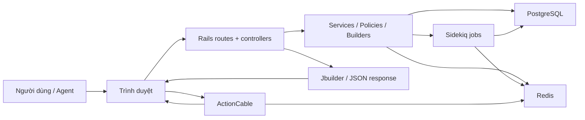
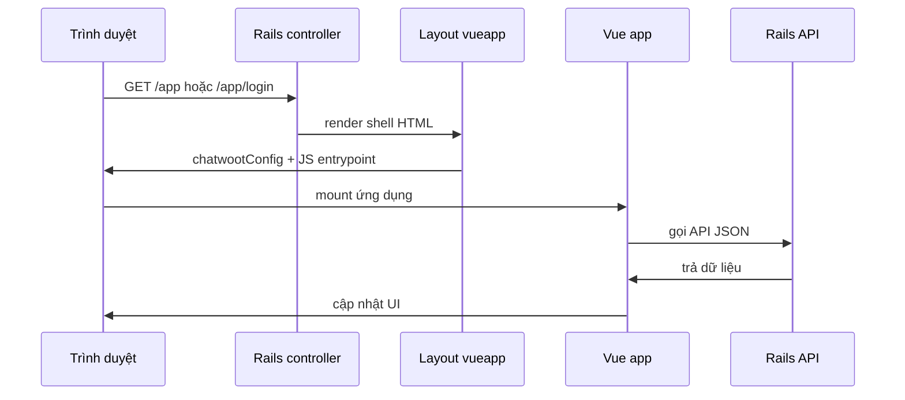
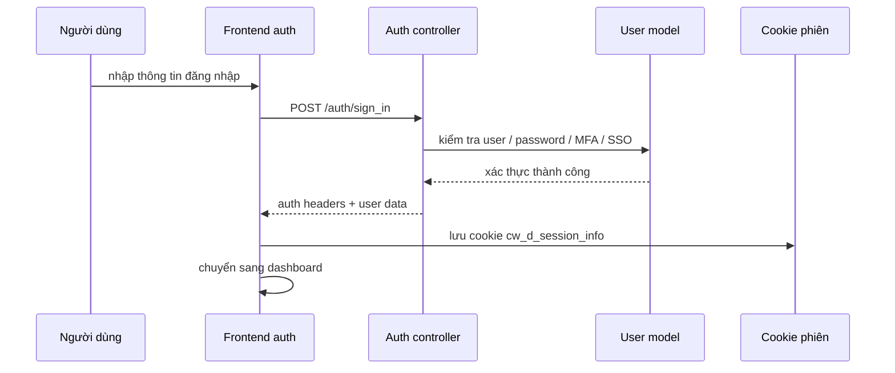
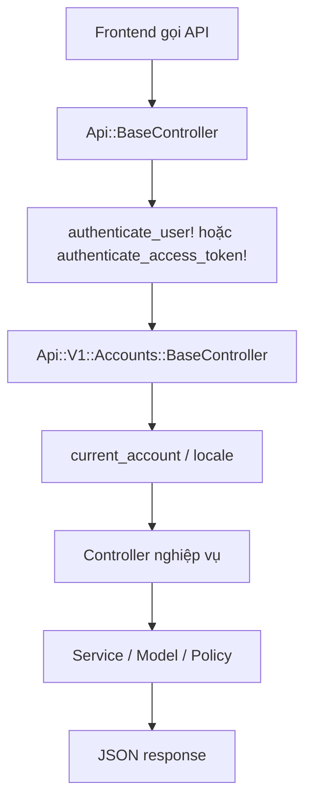
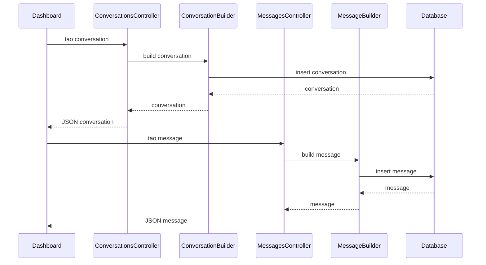

# Tổng quan kiến trúc Chatwoot

## Mục tiêu tài liệu

Tài liệu này giúp nắm nhanh:

- cấu trúc kiến trúc của source code
- các module chính nằm ở đâu
- luồng xử lý chính của ứng dụng
- cách request đi từ frontend đến backend và quay lại

## Bức tranh tổng thể

Chatwoot là một ứng dụng full-stack gồm nhiều lớp:

1. Rails làm backend chính
2. Vue 3 làm frontend cho dashboard, auth, widget, survey
3. PostgreSQL lưu dữ liệu nghiệp vụ
4. Redis dùng cho cache, token, realtime state và background jobs
5. Sidekiq xử lý tác vụ nền
6. ActionCable dùng cho realtime

## Sơ đồ kiến trúc tổng thể

## Các lớp chính trong source code

## 1. Rails backend

### Thư mục chính

- `app/controllers`
- `app/models`
- `app/services`
- `app/jobs`
- `app/policies`
- `app/channels`
- `app/views`

### Vai trò

- nhận request HTTP
- xác thực và phân quyền
- xử lý nghiệp vụ
- thao tác database
- trả JSON cho frontend
- phát sự kiện realtime

## 2. Frontend Vue

### Thư mục chính

- `app/javascript/entrypoints`
- `app/javascript/dashboard`
- `app/javascript/v3`
- `app/javascript/widget`
- `app/javascript/survey`
- `app/javascript/shared`

### Vai trò

- render giao diện
- điều hướng SPA
- gọi API Rails
- lưu state cục bộ
- nhận event realtime

## 3. Enterprise overlay

### Thư mục

- `enterprise/`

### Vai trò

- mở rộng hoặc override hành vi của bản OSS
- thêm tính năng enterprise
- giữ khả năng tách biệt giữa core và phần mở rộng

Khi sửa logic dùng chung, nên luôn kiểm tra cả `app/` và `enterprise/`.

## Các entrypoint frontend

Trong Chatwoot, không chỉ có một frontend app duy nhất.

### Các entrypoint quan trọng

- `dashboard.js`: dashboard chính sau đăng nhập
- `v3app.js`: login, signup, reset password
- `widget.js`: widget nhúng cho website
- `portal.js`: help center portal
- `survey.js`: khảo sát CSAT
- `superadmin.js`, `superadmin_pages.js`: giao diện super admin
- `sdk.js`: SDK widget

### File tham chiếu

- [dashboard.js](/Users/nguyenxuanhai/workspace/haiyen/chatwoot-4.12.1/app/javascript/entrypoints/dashboard.js)
- [v3app.js](/Users/nguyenxuanhai/workspace/haiyen/chatwoot-4.12.1/app/javascript/entrypoints/v3app.js)
- [widget.js](/Users/nguyenxuanhai/workspace/haiyen/chatwoot-4.12.1/app/javascript/entrypoints/widget.js)

## Luồng render giao diện

Chatwoot dùng Rails để trả HTML shell, sau đó Vue mount lên.

### Shell layout chính

- [vueapp.html.erb](/Users/nguyenxuanhai/workspace/haiyen/chatwoot-4.12.1/app/views/layouts/vueapp.html.erb)

Layout này làm các việc:

- inject `window.chatwootConfig`
- inject `window.globalConfig`
- nạp Vite client
- nạp entrypoint frontend phù hợp
- render `

` để Vue mount

## Sơ đồ luồng render frontend

## Luồng xác thực

### Thành phần chính

- `Devise`
- `DeviseTokenAuth`
- override controllers trong `app/controllers/devise_overrides`

### File quan trọng

- [config/routes.rb](/Users/nguyenxuanhai/workspace/haiyen/chatwoot-4.12.1/config/routes.rb)
- [user.rb](/Users/nguyenxuanhai/workspace/haiyen/chatwoot-4.12.1/app/models/user.rb)
- [sessions_controller.rb](/Users/nguyenxuanhai/workspace/haiyen/chatwoot-4.12.1/app/controllers/devise_overrides/sessions_controller.rb)

### Luồng auth tổng quát

1. Người dùng vào `/app/login`
2. Frontend auth app gọi `/auth/sign_in`
3. Backend xác thực user
4. Backend trả auth headers
5. Frontend lưu cookie phiên
6. Dashboard dùng cookie đó để đính kèm auth headers cho các API tiếp theo

## Sơ đồ luồng auth

## Luồng request API của dashboard

### Base controller

- [api/base_controller.rb](/Users/nguyenxuanhai/workspace/haiyen/chatwoot-4.12.1/app/controllers/api/base_controller.rb)
- [api/v1/accounts/base_controller.rb](/Users/nguyenxuanhai/workspace/haiyen/chatwoot-4.12.1/app/controllers/api/v1/accounts/base_controller.rb)

### Ý nghĩa

- xác thực người dùng hoặc `api_access_token`
- gắn `Current.user`
- xác định `Current.account`
- áp dụng locale theo account

### Luồng xử lý chuẩn

1. Frontend gọi API
2. Rails đọc auth headers
3. `Api::BaseController` xác thực
4. `Api::V1::Accounts::BaseController` gắn account hiện tại
5. Controller con xử lý nghiệp vụ
6. Render JSON bằng Jbuilder hoặc render trực tiếp

## Sơ đồ luồng request API

## Module nghiệp vụ trung tâm

## 1. User, Account, AccountUser

### Vai trò

- `User`: agent hoặc admin
- `Account`: workspace / tenant
- `AccountUser`: quan hệ user với account, chứa role và trạng thái hoạt động

### Lý do quan trọng

Phần lớn phân quyền không chỉ dựa vào `User`, mà còn dựa vào user đang thuộc account nào.

## 2. Inbox, Contact, ContactInbox

### Vai trò

- `Inbox`: kênh giao tiếp
- `Contact`: khách hàng
- `ContactInbox`: cầu nối giữa contact và inbox

### Ý nghĩa

Một contact có thể đi vào hệ thống từ nhiều inbox khác nhau.

## 3. Conversation

### File

- [conversation.rb](/Users/nguyenxuanhai/workspace/haiyen/chatwoot-4.12.1/app/models/conversation.rb)

### Vai trò

Conversation là thực thể trung tâm của hệ thống hỗ trợ khách hàng.

Nó gắn với:

- account
- inbox
- contact
- contact_inbox
- assignee
- messages

### Trạng thái chính

- `open`
- `resolved`
- `pending`
- `snoozed`

## 4. Message

### File

- [message.rb](/Users/nguyenxuanhai/workspace/haiyen/chatwoot-4.12.1/app/models/message.rb)

### Vai trò

Message là đơn vị nội dung trong conversation.

Nó có thể là:

- tin nhắn vào
- tin nhắn ra
- activity log
- template message

## Luồng conversation và message

### Controller conversation

- [conversations_controller.rb](/Users/nguyenxuanhai/workspace/haiyen/chatwoot-4.12.1/app/controllers/api/v1/accounts/conversations_controller.rb)

### Controller message

- [messages_controller.rb](/Users/nguyenxuanhai/workspace/haiyen/chatwoot-4.12.1/app/controllers/api/v1/accounts/conversations/messages_controller.rb)

### Luồng tạo conversation

1. Frontend gọi API tạo conversation
2. Controller tìm inbox, contact, contact_inbox
3. `ConversationBuilder` tạo conversation
4. Nếu có message đầu tiên thì tạo luôn message đầu tiên

### Luồng tạo message

1. Frontend gọi API tạo message
2. Controller lấy `Current.user`
3. Gọi `Messages::MessageBuilder`
4. Builder tạo message
5. Callback / job / dispatch event được kích hoạt nếu cần

## Sơ đồ luồng conversation và message

## Realtime

### Thành phần

- ActionCable
- channel chính: [room_channel.rb](/Users/nguyenxuanhai/workspace/haiyen/chatwoot-4.12.1/app/channels/room_channel.rb)

### Vai trò

- cập nhật presence
- đẩy message mới
- cập nhật conversation
- đồng bộ trạng thái typing

### Luồng cơ bản

1. Frontend kết nối websocket
2. Channel xác định user / contact qua `pubsub_token`
3. Server subscribe stream theo account hoặc contact
4. Khi có sự kiện, frontend nhận payload realtime

## Background jobs

### Thành phần

- Sidekiq
- queue config trong [config/sidekiq.yml](/Users/nguyenxuanhai/workspace/haiyen/chatwoot-4.12.1/config/sidekiq.yml)

### Công việc thường chạy nền

- gửi email
- gửi message ra kênh ngoài
- xử lý ảnh / file
- indexing / cleanup
- các integration async

## Frontend dashboard tổ chức như thế nào

### Router

- [dashboard router](/Users/nguyenxuanhai/workspace/haiyen/chatwoot-4.12.1/app/javascript/dashboard/routes/index.js)

Dashboard router:

- kiểm tra người dùng đã đăng nhập chưa
- nếu chưa thì chuyển về `/app/login`
- nếu có session thì cho vào route phù hợp

### Store

- [dashboard store](/Users/nguyenxuanhai/workspace/haiyen/chatwoot-4.12.1/app/javascript/dashboard/store/index.js)

Store được chia theo module:

- auth
- accounts
- conversations
- contacts
- inboxes
- notifications
- reports
- integrations
- captain

Đây là dấu hiệu cho thấy frontend dashboard khá lớn và được chia theo domain nghiệp vụ.

## Cách đọc code hiệu quả

Nếu cần hiểu nhanh một tính năng, nên đi theo chuỗi:

1. Route
2. Controller
3. Service hoặc Builder
4. Model
5. View JSON hoặc Jbuilder
6. Frontend API wrapper
7. Store
8. Component giao diện

## Ví dụ thực tế

Nếu muốn trace tính năng gửi tin nhắn:

1. `config/routes.rb`
2. `app/controllers/api/v1/accounts/conversations/messages_controller.rb`
3. `app/services/messages/...`
4. `app/models/message.rb`
5. `app/views/api/...`
6. `app/javascript/dashboard/api/...`
7. `app/javascript/dashboard/store/modules/...`
8. component conversation composer

## Kết luận

Kiến trúc Chatwoot có thể hiểu ngắn gọn là:

- Rails làm lõi backend và API
- Vue làm giao diện
- Conversation và Message là domain trung tâm
- Auth, realtime, jobs và integrations là các lớp hỗ trợ bao quanh

Muốn đọc nhanh source code, nên bắt đầu từ:

1. [config/routes.rb](/Users/nguyenxuanhai/workspace/haiyen/chatwoot-4.12.1/config/routes.rb)
2. [dashboard_controller.rb](/Users/nguyenxuanhai/workspace/haiyen/chatwoot-4.12.1/app/controllers/dashboard_controller.rb)
3. [api/base_controller.rb](/Users/nguyenxuanhai/workspace/haiyen/chatwoot-4.12.1/app/controllers/api/base_controller.rb)
4. [user.rb](/Users/nguyenxuanhai/workspace/haiyen/chatwoot-4.12.1/app/models/user.rb)
5. [conversation.rb](/Users/nguyenxuanhai/workspace/haiyen/chatwoot-4.12.1/app/models/conversation.rb)
6. [message.rb](/Users/nguyenxuanhai/workspace/haiyen/chatwoot-4.12.1/app/models/message.rb)
7. `app/services`
8. `app/javascript/entrypoints`
9. `app/javascript/dashboard`
